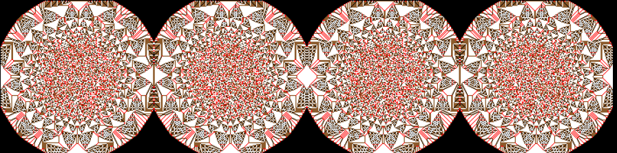
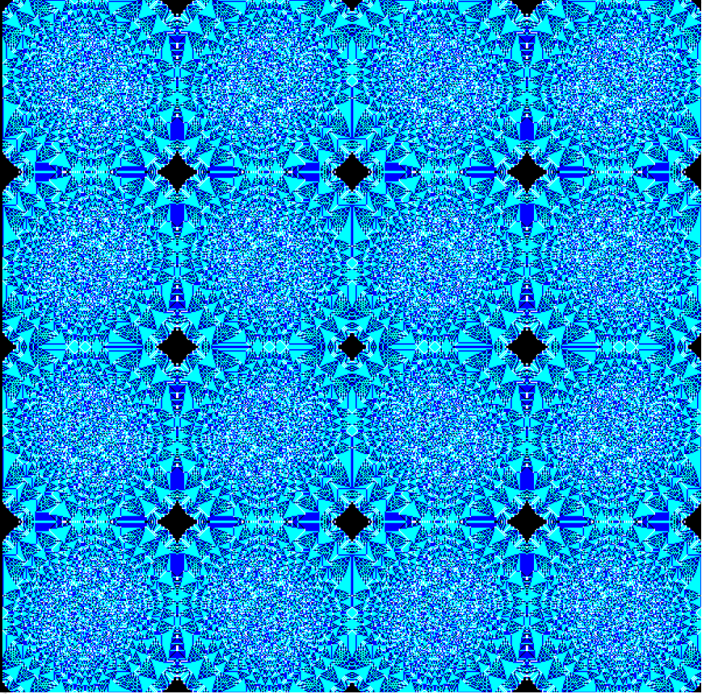

# Random Fractal Generator
It may take some minutes to finish (or just a couple of seconds). 

# Preview



# How do I run it? 
With Python 3.   

Linux:
```
python3 fractals.py
```

Windows:
```
python fractals.py
```
